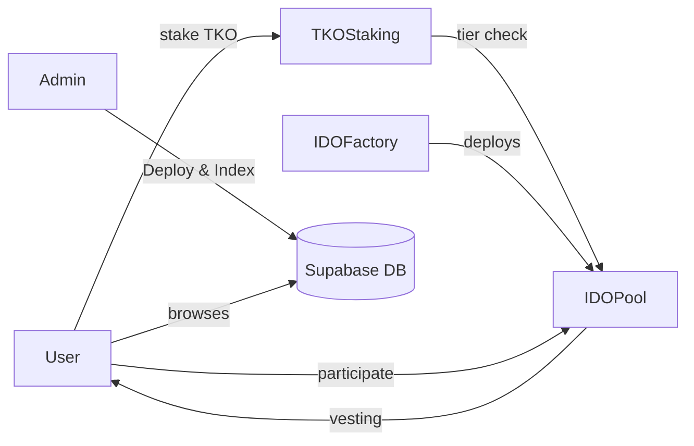

# NusantaraPad Phase 1: Smart Contract Architecture

## Overview

Audit-grade smart contract system for BSC IDO Launchpad using **Solidity 0.8.28** with **EIP-1153 Transient Storage** for gas-optimized reentrancy guards. Built with **Foundry** for testing.

---

## Tech Stack (Jan 2026)

| Layer | Technology |
|-------|------------|
| Contracts | Solidity ^0.8.28, Foundry/Forge |
| Gas Optimization | EIP-1153 `TSTORE`/`TLOAD` |
| Frontend | Next.js 16, React 19, Tailwind v4 |
| Web3 | Wagmi v3, Viem v3 |
| Runtime | Bun v1.2 |

---

## Proposed Changes

### Core Infrastructure

#### [NEW] [foundry.toml](file:///d:/Project/Web3/NusantaraPad/foundry.toml)

- Forge configuration for BSC + cancun EVM
- Solidity 0.8.28 with optimizer (200 runs)

---

### Token Contracts

#### [NEW] [MockTKO.sol](file:///d:/Project/Web3/NusantaraPad/src/mocks/MockTKO.sol)

- BEP-20 for testnet with public `mint()` function
- OpenZeppelin ERC20 base

---

### Staking System

#### [NEW] [TKOStaking.sol](file:///d:/Project/Web3/NusantaraPad/src/staking/TKOStaking.sol)

**Gas-Optimized ReentrancyGuard using EIP-1153:**

```solidity
// Transient storage slot for reentrancy lock
bytes32 private constant _REENTRANCY_SLOT = keccak256("nusantarapad.reentrancy");

modifier nonReentrant() {
    assembly {
        if tload(_REENTRANCY_SLOT) { revert(0, 0) }
        tstore(_REENTRANCY_SLOT, 1)
    }
    _;
    assembly {
        tstore(_REENTRANCY_SLOT, 0)
    }
}
```

**Tier Calculation:**

- Bronze: 500 TKO (Lottery)
- Silver: 2,000 TKO (1x Guaranteed)
- Gold: 10,000 TKO (3x Guaranteed)  
- Platinum: 50,000 TKO (10x + Private)

**Lock Multipliers:** 1.0x (none) → 1.2x (30d) → 1.5x (60d) → 2.0x (90d)

---

### IDO System

#### [NEW] [IDOPool.sol](file:///d:/Project/Web3/NusantaraPad/src/ido/IDOPool.sol)

- `participate()` with Merkle proof or on-chain tier check
- `claim()` with linear vesting (20% TGE, 10% monthly)
- `refund()` if soft cap not met
- EIP-1153 transient storage reentrancy guard

#### [NEW] [IDOFactory.sol](file:///d:/Project/Web3/NusantaraPad/src/ido/IDOFactory.sol)

- CREATE2 deterministic pool deployment
- Pool registry and enumeration

---

### Libraries

#### [NEW] [TierLib.sol](file:///d:/Project/Web3/NusantaraPad/src/libraries/TierLib.sol)

- Tier enum and threshold constants
- Allocation multiplier helpers

#### [NEW] [TransientReentrancyGuard.sol](file:///d:/Project/Web3/NusantaraPad/src/libraries/TransientReentrancyGuard.sol)

- Reusable EIP-1153 reentrancy guard abstract contract

---

### Phase 4: Admin & Metadata (NEW)

#### [NEW] [route.ts](file:///d:/Project/Web3/NusantaraPad/frontend/src/app/api/pools/route.ts)

- `GET /api/pools`: Returns all pool metadata
- `POST /api/pools`: Saves new pool metadata
- Storage: `frontend/src/data/pools.json`

#### [NEW] [AdminPage](file:///d:/Project/Web3/NusantaraPad/frontend/src/app/admin/page.tsx)

- Protected route (simple address check or public for dev)
- Form to deploy new IDO pools
- Inputs: Sale Token, Price, Caps, Vesting Schedule, Project Name, Desc, Logo
- Atomic operation: Deploy Contract -> Save Metadata

---

## Completed Features (Phase 4 & 5)

### Admin Dashboard (`/admin`)

- [x] **Pool Deployment**: UI form to deploy new IDO pools via `IDOFactory`.
- [x] **Address Prediction**: `computePoolAddress` used to predict address before deployment.
- [x] **Metadata Management**: Local API (`/api/pools`) stores project name, description, and logo mapped to pool address.

### Frontend Enhancements

- [x] **Dynamic Pools Page**: Fetches all pools from factory + metadata from API.
- [x] **Vesting Chart**: Visualizes TGE, Cliff, and Vesting schedule using `useIDOPool` hook data.
- [x] **Participation Flow**: Integrated Approve/Buy flow with status updates.

## Verification Plan

### Automated Tests

- Foundry tests passing (25/25).

### Manual Verification

- [x] Staking & Tier calculation.
- [x] IDO Participation (Buy).
- [x] Admin Pool Creation.
- [x] Metadata Persistence.
- [x] Vesting Claim Logic.

### Automated Tests (Foundry)

```bash
forge test -vvv
forge coverage
```

### Test Coverage

| Contract | Tests |
|----------|-------|
| TKOStaking | stake/unstake, tier calc, lock multipliers, emergency |
| IDOPool | participate, merkle proofs, vesting, refunds |
| IDOFactory | pool creation, deterministic addresses |

---

### Claiming (With Owner Controls)

1. **Preparation**:
    - Deploy Pool.
    - Go to Project Details (`/pools/[address]`).
    - **New**: Use "Owner Controls" panel to *Approve* and *Deposit* Sale Tokens.
2. **Participation**: Buy tokens.
3. **Finalization**: Wait for End Time, then click *Finalize* in Owner Controls.
4. **Claim**: Click *Claim Tokens*. Verify balance.

## Phase 2: Production Readiness (Metadata & Indexing)

### Metadata Architecture (Supabase)

To solve the "local JSON" issue and "slow indexing" issue simultaneously, we will effectively use a centralized database (Supabase) as an **Off-chain Indexer**.

#### 1. Database Schema (`pools` table)

- `chain_id` (int8)
- `pool_address` (text, PK)
- `project_name` (text)
- `description` (text)
- `logo_url` (text)
- `created_at` (timestamp)

#### 2. Frontend Integration

- **Write**: When Admin deploys a pool -> `POST /api/pools` -> Inserts into Supabase.
- **Read**: Pools Page fetches list from Supabase (fast, paginated) instead of iterating contract array.
- **Contract Data**: Use `useReadContracts` (multicall) to fetch on-chain status (raised, filled) for the pools returned by Supabase.

### Implementation Steps

1. **Setup Supabase Client**: Add `v2` libraries.
2. **Migration**: Create SQL migration script.
3. **API Update**: Rewrite `/api/pools/route.ts` to use Supabase.
4. **Frontend Update**: Switch `usePools` hook to fetch from DB first.

---

## Architecture


